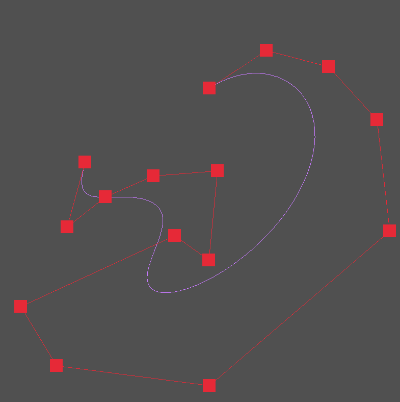

"""

# Bezier Curve Implementation with Raylib

This project demonstrates the implementation of Bezier curves in C using the raylib graphics library. Bezier curves are widely used in computer graphics to model smooth curves that can be scaled indefinitely.

## Table of Contents

- [Introduction](#introduction)
- [Mathematical Background](#mathematical-background)
- [Features](#features)
- [Screenshots](#screenshots)
- [Prerequisites](#prerequisites)
- [Installation](#installation)
- [Usage](#usage)

## Introduction

Bezier curves are a fundamental tool in computer graphics and animation for creating smooth and scalable curves. This project showcases how to create and manipulate Bezier curves using the C programming language and the raylib graphics library.

## Mathematical Background

A Bezier curve is defined by a set of control points. The most common types are:

- **Linear Bezier Curve** (defined by 2 points)
- **Quadratic Bezier Curve** (defined by 3 points)
- **Cubic Bezier Curve** (defined by 4 points)

The mathematical formula for a cubic Bezier curve is:

$$ B(t) = (1 - t)^3 P_0 + 3(1 - t)^2 t P_1 + 3(1 - t)t^2 P_2 + t^3 P_3 $$

where $t$ is a parameter between 0 and 1, and $P_0, P_1, P_2, P_3$ are the control points.

## Features

- Implementation of cubic Bezier curves.
- Interactive visualization using raylib.
- Adjustable control points to see real-time updates of the curve.

## Screenshots



_Bezier curve showing smooth transitions between points._

## Prerequisites

- C compiler (gcc, clang)
- raylib library (it is included in the repository)
- make
- linux (or WSL on Windows) , for other platforms you can use the raylib library and compile the code with the raylib library (https://www.raylib.com/)

## Installation

1. **Clone the repository:**
   ```sh
   git clone https://github.com/edaywalid/Bezier
   cd Bezier
   ```

## Usage

- **Run the program:**
  ```sh
  make run
  ```
